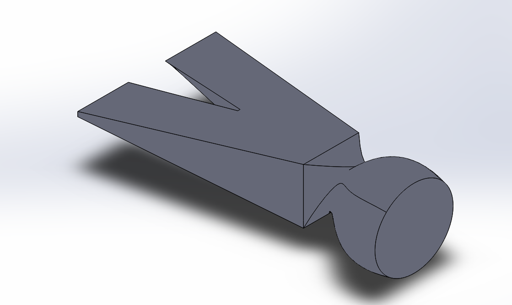
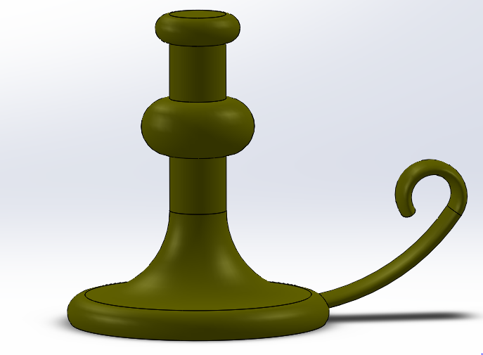
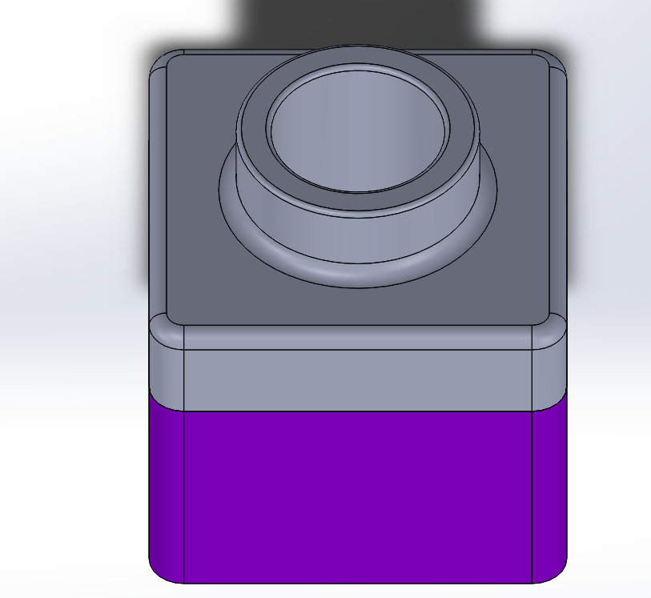
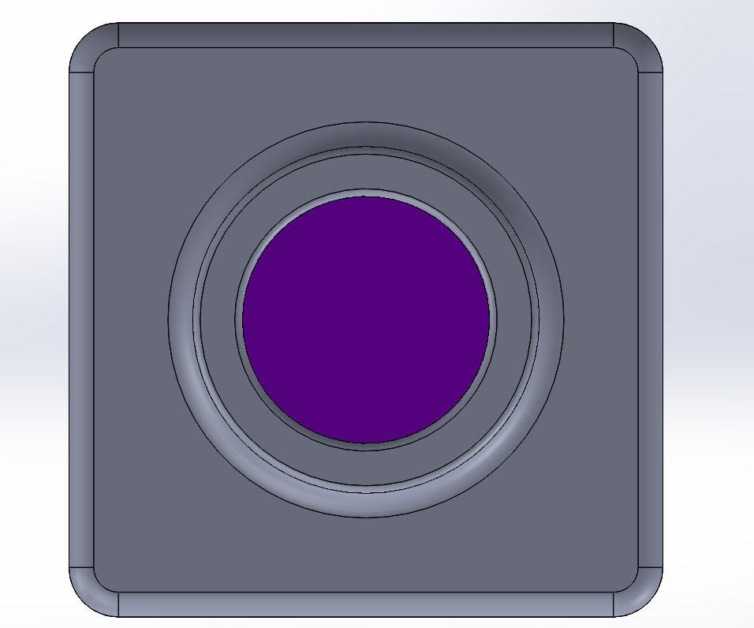
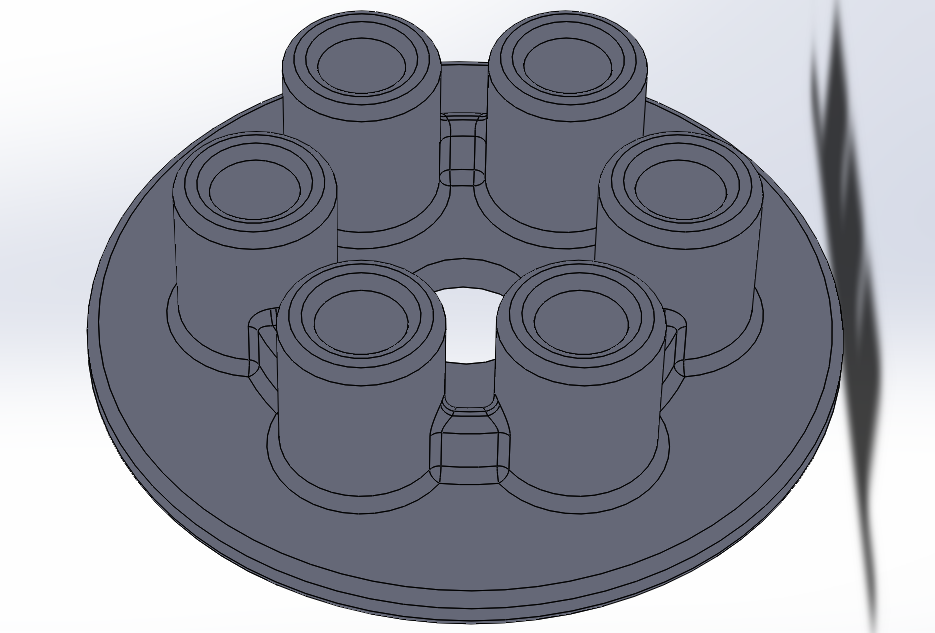

# Sweeps & Lofts
### Intro
Sweeps and lofts are 2 different assignments. Lofts is creating a hammer head by using 4 different planes with 2d drawing to make a 3d shape. Lofts is making a candle holder by revolving shapes around an axis and to make the holder for it i used an ellipse that followed a line and its path was made 3D.
### What I Learned
I learned that you can create unnatural 3D shapes using regular 2d shapes like squares and circles. Also in a sweep the trail of the shape is saved and that is what creates the shape.

### photos
#### LOFTS

#### SWEEPS

# A little practice
### INTRO
A little practice also has 2 different assignments. One of them is making a 1x1 lego using fillets and shell to hollow out the inside of a box. The other one is making a pressure plate using linear patterns and fillets.
### What I Learned
In this assignment I got a lot better at making assemblys and I used the function to hollow out the sedcond part of the lego, With the pressure plate I got more familiar with linear patterns and fillets.
### Photos

